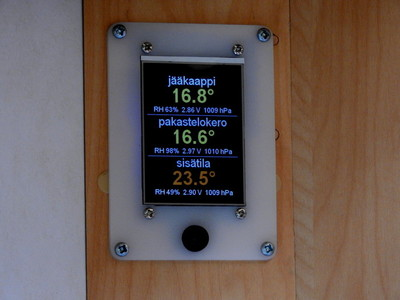
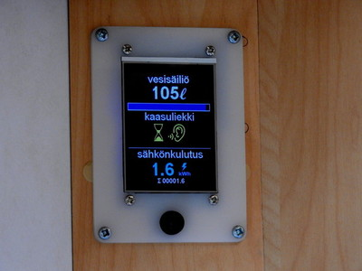

# OH2MP ESP32 Smart RV

### An ESP32 based smart screen for a motorhome or caravan

This project is for to make a "central screen" for a motorhome or caravan. The software listens to
several BLE beacons and shows their data on a TFT display. The architecture is very modular. Several
different BLE beacons are supported now and more are to come. If you don't have all of those beacons, you can 
just ignore the support. The software shows data only from known beacons that are configured from the
web portal (see later).

The temperatures, pressure, humidity etc. use [Ruuvi tags](https://ruuvi.com/). Ruuvi tag is an excellent
product and with them there's no need of inventing the wheel again.

Other beacons that are supported are:

- [ESP32 Water sensor](https://github.com/oh2mp/esp32_watersensor)
- [ESP32 Energy meter](https://github.com/oh2mp/esp32_energymeter)
- [ESP32 MAX6675 beacon for thermocouples for gas fridge](https://github.com/oh2mp/esp32_max6675_beacon)

Don't worry that the sensor names in these example photos are in Finnish. They are fully configurable via
portal mode that is in English.




------

The screen graphics use [Bodmer's TFT_eSPI library](https://github.com/Bodmer/TFT_eSPI).

The library needs to be configured for the right driver chip etc. and with this project it's enough
to change file `libraries/TFT_eSPI/User_Setup.h` lines 188-193 as follows:

```c
// #define TFT_MISO 19
#define TFT_MOSI 23
#define TFT_SCLK 18
#define TFT_CS   15  // Chip select control pin
#define TFT_DC    4  // Data Command control pin
#define TFT_RST   2  // Reset pin (could connect to RST pin)
```

It's very recommended to use exactly these pins for the display even though they are configurable. 
They have been tested and work well. The MISO pin is not connected because we are not reading anything
from the display driver chip in this project.

In the main program code there are defines for push button and backlight LED. 
Connect a button between the pin and ground and connect the LED pin to the display's BL pin.
Short press increases the lightness of the screen and long press switches the unit to the portal mode.

```c
#define BUTTON 12                // push button for lightness and long press starts portal
#define BLLED 19                 // backlight led
```

------
